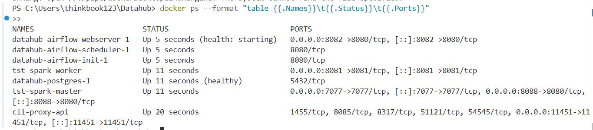
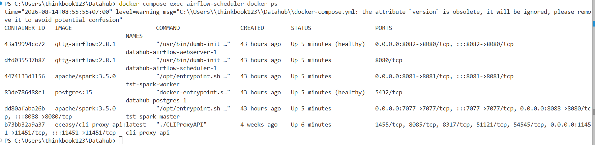
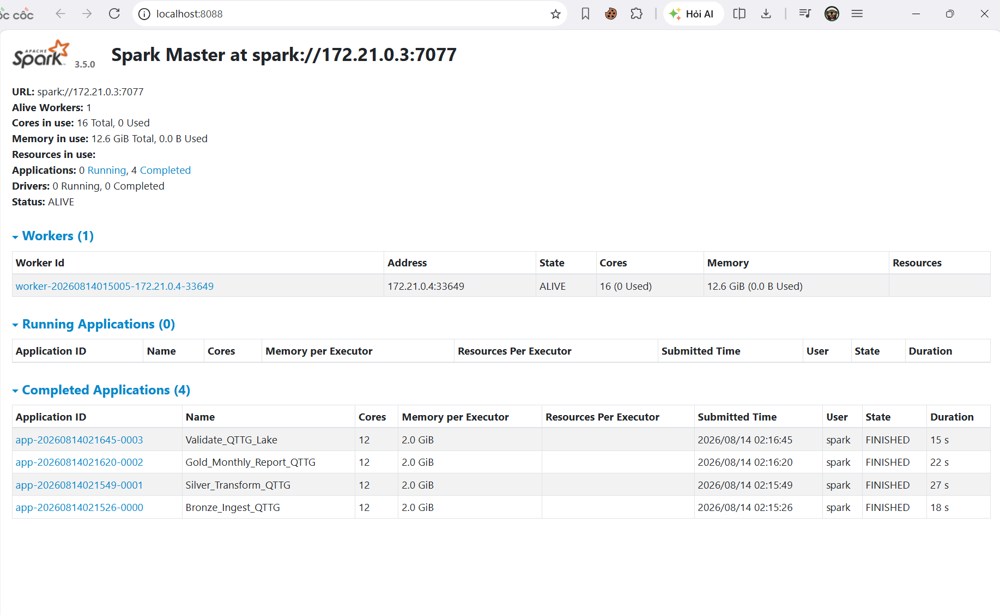
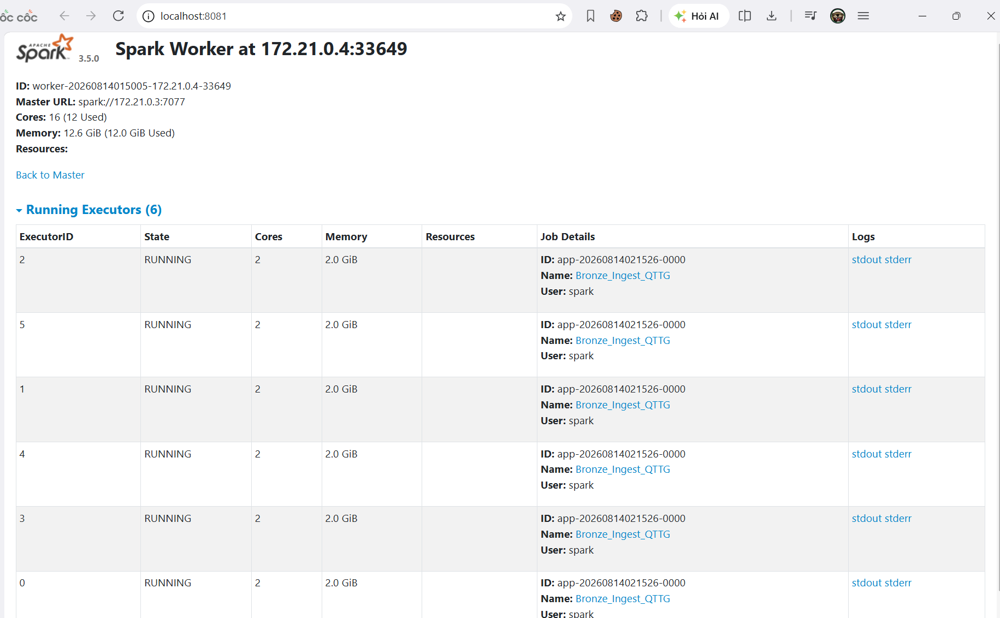
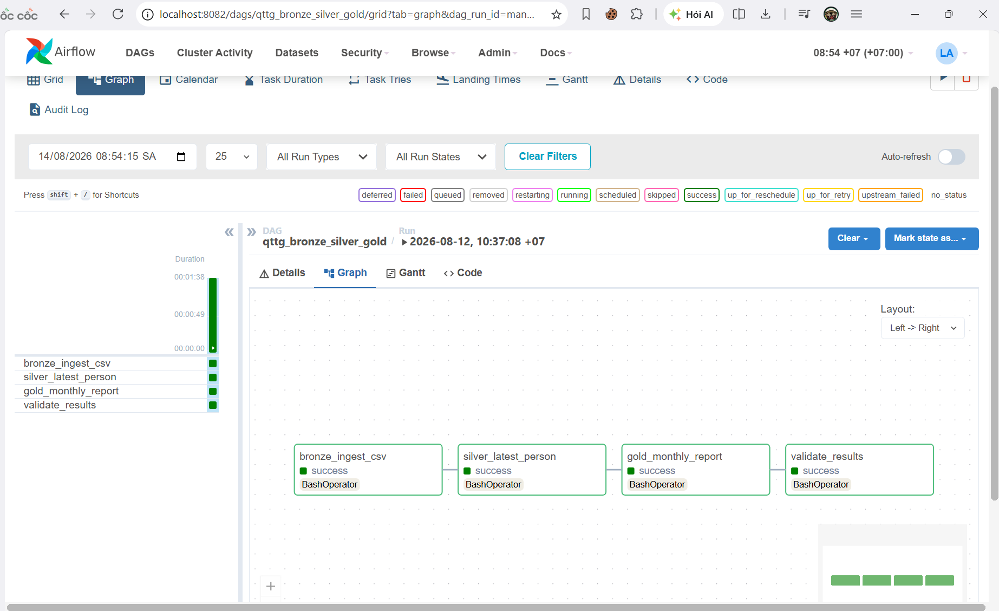
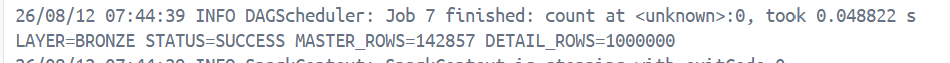
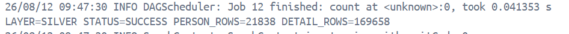
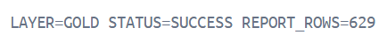
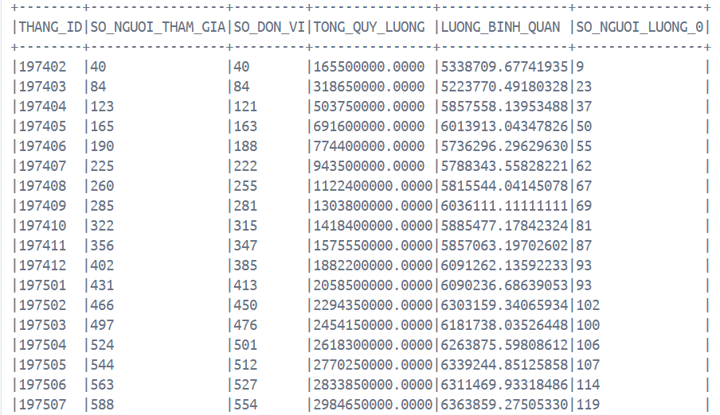
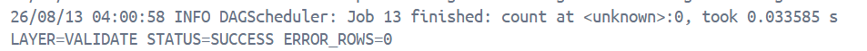

# QTTG Spark ETL

Dự án này xử lý dữ liệu QTTG BHXH bằng PySpark theo mô hình nhiều tầng trong data lake.
Mục tiêu là đọc dữ liệu raw CSV, làm sạch và chuẩn hóa dữ liệu, sau đó tổng hợp báo cáo theo tháng và kiểm tra tính toán vén của kết quả.

## Cấu trúc xử lý

- `schemas.py`: Khai báo schema cho 2 file raw `RAW_QTTG_BHXH.csv` và `RAW_QTTG_BHXH_DETAIL.csv`.
- `bronze_qttg.py`: Đọc CSV theo schema, kiểm tra số dòng đầu vào, ghi dữ liệu gốc sang tầng Bronze.
- `silver_qttg.py`: Làm sạch trường dữ liệu, soft-delete bản ghi master cũ, và join detail với master đang active.
- `gold_qttg.py`: Sinh danh sách tháng, mở rộng detail theo khoảng tháng, tổng hợp chỉ tiêu báo cáo theo `THANG_ID`.
- `validate_qttg.py`: Kiểm tra các rule chất lượng dữ liệu sau ETL.
- `qttg_test.ipynb`: Notebook để test logic từng tầng trong Jupyter.

## Các rule chính

- Bronze phải đúng số dòng kỳ vọng:
  - `master = 142857`
  - `detail = 1000000`
- Silver chỉ giữ 1 bản ghi master active mỗi `SO_SO_BHXH`.
- Silver detail không được mở cơi và phải có `TU_THANG <= DEN_THANG`.
- Gold không được trùng `THANG_ID`.

## Cách chạy

Tất cả script hiện dùng `argparse` với tham số bắt buộc.

Ví dụ:

```bash
python bronze_qttg.py --input-dir C:/Users/thinkbook123/Datahub/output/raw_qttg_1m --output-dir C:/Users/thinkbook123/Datahub/output/lake/bronze
python silver_qttg.py --input-dir C:/Users/thinkbook123/Datahub/output/lake/bronze --output-dir C:/Users/thinkbook123/Datahub/output/lake/silver
python gold_qttg.py --input-dir C:/Users/thinkbook123/Datahub/output/lake/silver --output-dir C:/Users/thinkbook123/Datahub/output/lake/gold
python validate_qttg.py --lake-dir C:/Users/thinkbook123/Datahub/output/lake
```

## Ghi chú test

- Nếu test bằng Jupyter trên Windows, ưu tiên dùng `qttg_test.ipynb`.
- Notebook được thiết kế để test logic trên DataFrame trong bộ nhớ, tránh lỗi `HADOOP_HOME` khi ghi parquet local.
- Khi cần test end-to-end ghi file thật, nên chạy bằng `spark-submit` hoặc môi trường Spark đã cấu hình đầy đủ.

## Kết quả minh họa

Các ảnh dưới đây được bổ sung theo checklist báo cáo trong tài liệu `HUONG_DAN_AIRFLOW_SPARK_LOCAL.md`.

### 1. Kiểm tra container và tên Spark Master

Ảnh kiểm tra tên container Spark Master để cấu hình đúng `SPARK_CONTAINER` trong DAG:



Ảnh kiểm tra Airflow scheduler gọi được Docker Desktop:



### 2. Spark Master UI

Ảnh giao diện Spark Master cho thấy worker đã kết nối và cluster đang sẵn sàng nhận job:



Ảnh giao diện Spark Worker cho thấy tài nguyên worker đang ở trạng thái `ALIVE`:



### 3. Airflow DAG chạy thành công

Ảnh Airflow Grid/Graph khi toàn bộ task `bronze -> silver -> gold -> validate` chạy thành công:



### 4. Log từng layer

Log Bronze với số dòng `master` và `detail` sau khi ingest:



Log Silver với số người và số detail sau chuẩn hóa:



Log Gold với trạng thái thành công:



Phần bảng báo cáo tháng mẫu ở Gold:



Log Validate với `ERROR_ROWS=0`:


